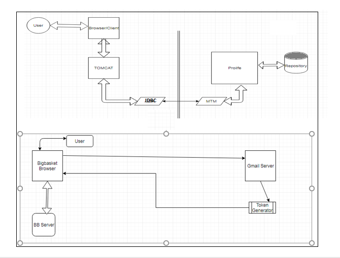
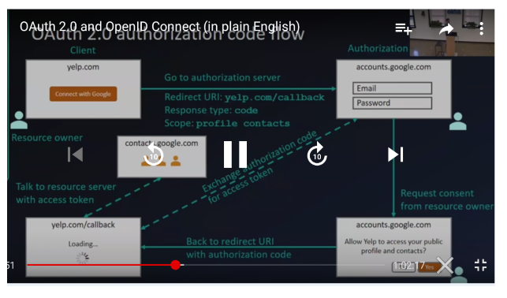
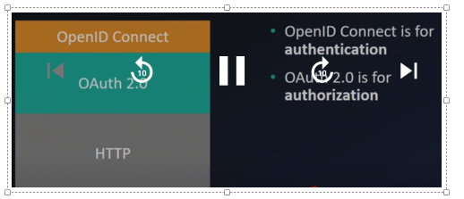
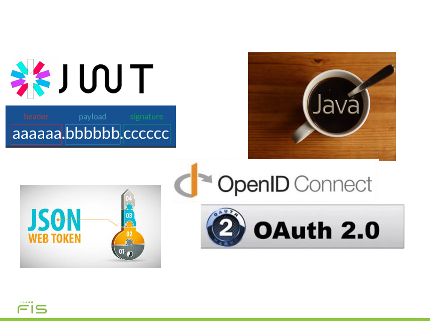
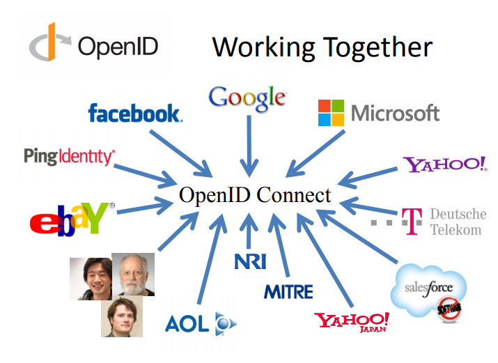

# InnovateIN48 1MicroTeam WebSecureOpenIDConnectPro
This is a Java based application for authenticating and authorizing a user in a advanced and secure standard formatted way using JWT[JSON Web token].
When the user is authenticated you will see the result from a call to UserInfo and the contents of the id_token which was returned from OIDC.

## NOTE
This client uses the stable CURRENT-environment, which is set up with the BankID Preprod user-database.
New test-users can be created self-serviced at https://local.test-users.no/


## Current System and proposed model with simple example.



## Proposed logical architecture



## Layer and levels 



## Technologies used



## Working together 



## Process flow
The application exemplifies all steps of the OIDC authentication process.


## Benefits of
•Spans use cases, scenarios 
	– Internet, Enterprise, Mobile, Cloud 
•Spans security & privacy requirements 
	– From non-sensitive information to highly secure 
•Spans sophistication of claims usage 
	– From basic default claims to specific requested claims to aggregated and distributed claims 
•Maximizes simplicity of implementations 
	– Uses existing IETF specs: OAuth 2.0, JWT, etc. 
	– Lets you build only the pieces you need 
	- Increased trust between parties
	- Secure and tamper proof sharing
	- Fraud prevention

1. Fetch configuration from OIDC. GET to a non protected URL, such as 
   https://oidc-current.localhost.no/auth/realms/current/.well-known/openid-configuration
   The configuration contains information such as relevant endpoints, and public key for the id_token (JWT).

2. Redirect to the authentication URL.

3. Handle the callback from OIDC. The callback contains an attribute *access_code* which needs to be exchanged with the *access_token* (POST to OIDC)

4. Fetch user info. Finally we use the *access_token* to fetch a protected resource, in this case the user info provided by OIDC.

## Build and run
To be able to run the application you will need to edit the client_id and client_secret in the Configuration.class.


```
class Configuration {

    /**
     * Client_id and secret must be inserted here for the application to work.
     * 
     */
    public static final String CLIENT_ID = "<insert client_id>";
    public static final String CLIENT_SECRET = "<insert client password>";
}
```


Run with maven and jetty
```
mvn clean install
mvn jetty:run
```


## Dependencies
This example application uses the following libraries

**javax.servlet-api** for web gui

**jersey-client** used in all integration

**oauth2-client** oauth2 support in jersey

**org.json.json** for json parsing

**nimbus-jose-jwt** for handling the json web token

**jetty-maven-plugin** for running the application locally with a dynamically created ssl-certificate.


## Working Group Members [1MicroTeam : Bangalore : India]
* Sha Mirza 			[Sha.Mirza@fisglobal.com]
* Jaywant Khairner		[Jaywant.Khairnar@fisglobal.com]
* Fahad Hashmi			[Fahad.Hashmi@fisglobal.com]


